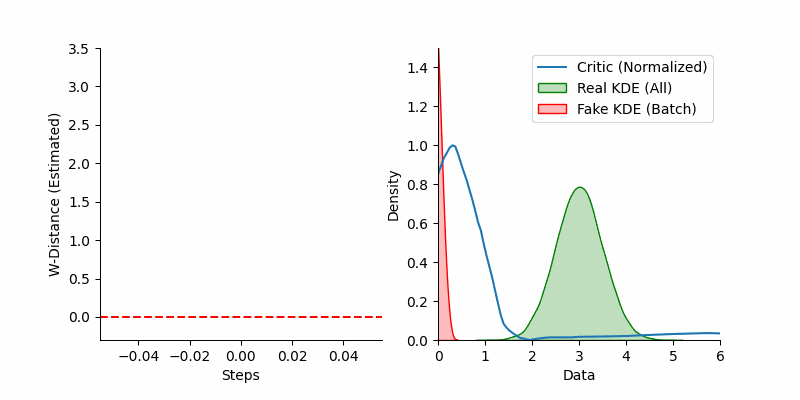
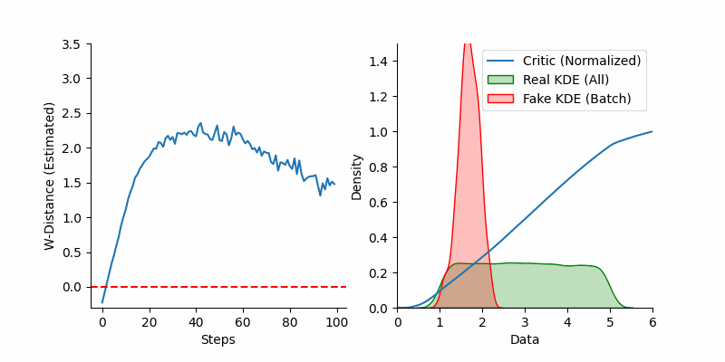
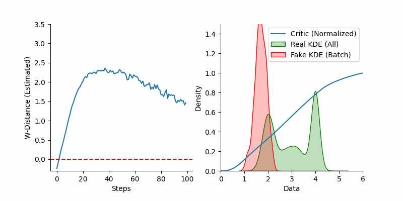

# pytorch-wgan

Core concepts:
1. Kantorivich-Rubinstein theorem applied to Wasserstein distance
2. WGAN training procedure with parametrized generator and critic
   - Weight clipping
   - Gradient penalty
3. Instantiations of WGAN
   - MLP
   - DCGAN
     - Architecture guidelines
     - Batch normalization
     - ConvTranspose

## WGAN-GP with MLPs on 1D distributions

LayerNorm and two-sides gradient penalty were required for this to work nicely.

### Normal

### Uniform

### Bimodal

